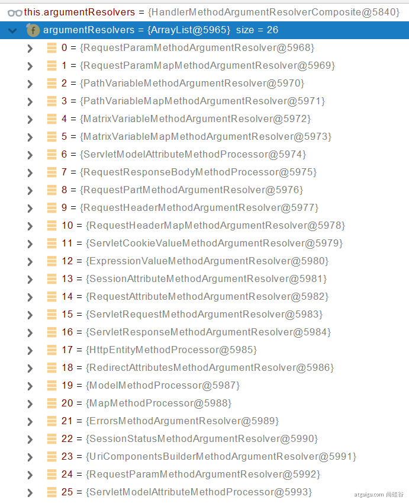
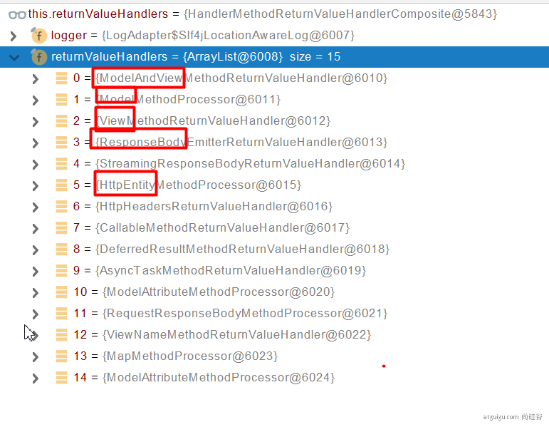
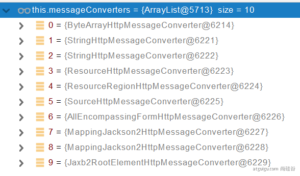
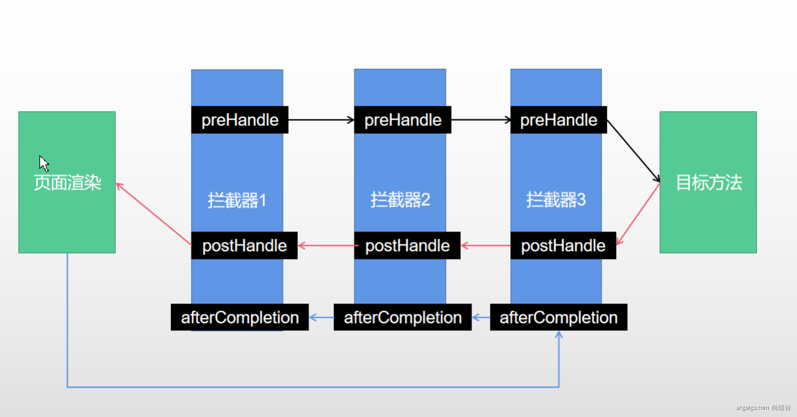

# @Import 注解

@Import只能用在类上 ，@Import通过快速导入的方式实现把实例加入spring的IOC容器中

第一种用法：@Import（{ 要导入的容器中的组件的class数组 } ）：容器会自动注册这些组件，id默认是全类名。比如@Import({User.class}),那么就会导入一个User的Bean到容器中
在SpringBoot源码中，可以看到@Import(xxxConfiguration.class)的操作，这样会注入配置类中的Bean并且配置类也会被注入容器

第二种用法：@Import(一个实现了ImportSelector接口的类的class)：ImportSelector接口的selectImports方法返回需要导入的组件的全类名数组，springboot底层用的特别多【重点 】

第三种用法：ImportBeanDefinitionRegistrar：手动注册bean到容器


# @Configuration

配置类，表明此类中的方法会返回一个Bean，并且许多注解只能在带这个注解的上


# @Conditional

按需加载的原理，这个注解只有当它的value属性返回true时，这个Bean才会被注册进容器。value属性是一个class[]。
根据这个注解，SpringBoot又派生出@ConditionalOnBean、@ConditionalOnMissingBean等一系列更细致的注解
需要value属性中的class[]类实现了Condition接口重写了match()

# @ImportResource

从XML配置文件中读取其中配置好的Bean

# @ConfigurationProperties
@value 有着相同的功能，但更为便捷的从外部读取配置信息

1. 作用在类上
    从SpringBoot的配置文件中读取配置信息，并将读取出来的配置信息与当前类中的属性进行绑定。当与@Component注解放在一起的时候，就可以实现让有这个注解的类读取配置文件信息。
    
 ```
    
            @Bean
            @ConfigurationProperties(prefix = "spring.datasource.hikari")       在注入HikariDataSource的时候，会自动注入一个DataSourceProperties的依赖
            HikariDataSource dataSource(DataSourceProperties properties)        又因为在此类上标注了@EnableConfigurationProperties(DataSourceProperties.class)，所以DataSourceProperties会读取配置文件的信息并与其属性自动绑定并被注入进容器。
            
 ``` 
   
2. 作用在方法上
    只能作用在@Configuration的类中@Bean的方法上，作用是将配置文件的信息与创建的Bean中的属性进行绑定（隐式绑定，意味着在配置文件编写的时候需要与对应类的字段名称相同）
```

            @ConfigurationProperties(prefix = "spring.datasource.druid.write")
            @Bean(name = "writeDruidDataSource")
            @Primary
            public DataSource writeDruidDataSource() {      这里会将外部文件中读取信息到DataSource这个Bean的属性中
                return new DruidDataSource();
            }

```

3. 原理
    通过类的setXXX方法
    
# @EnableConfigurationProperties

value属性 允许带@ConfigurationProperties的类可以读取配置文件中的配置信息  这是另一种让@ConfigurationProperties生效的办法

SpringBoot自动配置原理:

    1.@SpringBootApplication注解分为三部分:
        1)@SpringBootConfiguration   就是一个Configuration
        2)@EnableAutoConfiguration   开启自动配置，重点
        3)@ComponentScan     扫描当前包下的所有Component
    2.@EnableAutoConfiguration分为两个部分:
        1)@AutoConfigurationPackage 
        2)@Import(AutoConfigurationImportSelector.class)    注册这个Bean
    3.AutoConfigurationImportSelector       以下是逐层调用的关系，1步骤会调用2步骤的方法，2步骤会调用3步骤的方法.....
        1)由于这个类是由@Import注解导入的，所以会调用其内部的selectImports()->getAutoConfigurationEntry()   导入所有应该被导入为组件的auto-configurations类，并根据SpringBoot配置文件来配置或默认配置
        2)调用List<String> configurations = getCandidateConfigurations(annotationMetadata, attributes)扫描所有Jar包下"META-INF/spring.factories"的配置类,加载其中所有的auto-configuration类 
        3)利用工厂加载 Map<String, List<String>> loadSpringFactories(@Nullable ClassLoader classLoader)得到所有的组件
        4)从META-INF/spring.factories位置来加载一个文件。默认扫描我们当前系统里面所有META-INF/spring.factories位置的文件
    4.按需加载
        1) 虽然所有的 auto-configurations类 都应该被注册为Bean，但每个自动配置类都会根据条件再注册，主要根据@Condition派生出的一系列注解实现
        2) @ConditionalOnxxx 只有满足条件时，才会注册这个Bean
        3) @ConfigurationProperties  EnableConfigurationProperties(xxx.class)  从springboot配置文件中读取配置信息
        4) xxxProperties类   默认的配置信息，我们通过SpringBoot配置文件，可以实现对这些信息的修改
        
        
# 静态资源配置原理（会先对请求进行处理映射判断，如果没有符合地址栏条件的处理器controller，那么就会进行静态资源映射，或者报错）：
    1. SpringBoot启动默认加载  xxxAutoConfiguration 类（自动配置类）
    2. SpringMVC功能的自动配置类 WebMvcAutoConfiguration，生效
    3. 在WebMvcAutoConfiguration配置类中，注册了WebMvcAutoConfigurationAdapter这个Bean
    4. 这个Bean允许WebMvcProperties类与spring.mvc、ResourceProperties类与spring.resources进行了属性绑定，允许其从配置文件读取信息
    5. 在这个Bean中调用了addResourceHandlers方法，默认会对/webjars/**进行映射到"classpath:/META-INF/resources/webjars/，而其他静态资源默认为 { "classpath:/META-INF/resources/","classpath:/resources/", "classpath:/static/", "classpath:/public/" }
    6. 可在配置文件中设置add-mappings:false 禁用所有静态资源规则
    7. 欢迎页有一个专门的Bean: WelcomePageHandlerMapping 进行映射
    
    
#Rest原理（表单提交要使用REST的时候）
    1.表单提交会带上_method=PUT
    2.请求过来被HiddenHttpMethodFilter拦截
    3.请求是否正常，并且是POST
    4.获取到_method的值。
    5.兼容以下请求:PUT.DELETE.PATCH
    6.原生request（post），包装模式requesWrapper重写了getMethod方法，返回的是传入的值。
    7.过滤器链放行的时候用wrapper。以后的方法调用getMethod是调用requesWrapper的。
    
# 为什么Controller方法的参数可以随意写
    因为会进行参数解析，比如String会调用RequestParamMethodArgumentResolver解析器进行解析，对其进行合理的初始化，所以我们可以随意写上

# 请求路径映射原理


    1. 核心方法:DispatcherServlet中的doService方法
    2. Spring容器中存在handlerMappings，其会将注入多个hanlderMapping，其中就有RequestMappingHandlerMapping：保存了所有带有@RequestMapping的 路径和请求方式(Key) 与 具体方法(value)的映射规则。WelcomePageHandlerMapping:保存了Welcome页面的映射规则。
    3. 每一个请求在映射的时候，都会遍历handlerMappings，对每个hanlderMapping都尝试是否存在可以解决的映射
        如果可以解决，那么就使用这个handler
        如果无法解决，就使用下一个hanlderMapping
    4. 如果找到了一个hanlderMapping可以解决目标地址，那么就会遍历其内部的registry，找到符合条件的方法
    4. 在RequestMappingHandlerMapping中可能存在同一个url有不同请求方式的映射，这时候会选择最合适的一个进行映射，而如果有两个同样合适（URL、请求方式都一样）的，就会报错。
    5. 如果请求的地址没有hanlderMapping可以解决，那么就会认为是静态资源去访问或者报错
    
# 请求处理的方法


    1. REST风格的路径变量获取：@PathVariable，使用这个注解，可以让controller参数与url参数进行绑定(可使用HashMap参数，自动将所有的url参数绑定到这个HashMap）
    2. 请求头信息：@RequestHeader，使用这个注解，可以让controller参数与请求中的header信息进行绑定(可使用HashMap参数，自动将所有的url参数绑定到这个HashMap）
    3. 问号传参的路径变量获取：@RequestParam,使用这个注解，可以让controller与url参数绑定(可使用HashMap参数，自动将所有的url参数绑定到这个HashMap）
    4. Cookieh信息获取：@CookieValue，使用这个注解，可以让controller中的参数与cookie的值绑定(可使用Cookie类型参数，自动将所有的url参数绑定到这个Cookie）
    4. 请求域中的值获取:@RequestAttribute，使用这个注解，可以让controller中的参数与原生servlet的request绑定
    
# 请求处理原理
前言：目标方法的所有参数都会被UrlPathHelper把url路径中的所有变量解析出来保存到request请求域中，所以之后需要使用的时候，只需要去请求域中去取就可以了
    
    1. 核心方法：DispatcherServlet->doService()->doDispatch(),先找到合适的HandlerMapping并得到可以处理请求的handler(具体的Controller.method())
    2. getHandlerAdapter(mappedHandler.getHandler()) 这里采用适配器设计模式，对找到的可以处理这个请求的handler进行适配
    3. HandlerAdapter:适配器接口，有两个方法:1.handle 执行方法 2.supports 判断当前适配器是否支持请求的handler
    4. getHandlerAdapter执行过程中会对所有的适配器进行一个遍历，找到可以适配当前handler的去执行后序步骤
        所有的适配器有:
            1) RequestMappingHandlerAdapter     支持方法上标注@RequestMapping类注解的
            2) HandlerFuctionAdapter        支持函数式编程的
            3) HttpRequestHandlerAdapter
            4) SimpleControllerHandlerAdapter
    5. 执行完 getHandlerAdapter 后会执行handle()，在这个方法中会完成参数解析、返回值解析等功能
    6. 而handle方法会调用RequestMappingHandlerAdapter中的handleInternal()->invokeHandlerMethod()
    7. invokeHandlerMethod方法中会对目标方法进行一个包装，然后为目标方法设置参数解析器（26个）、返回值处理器（15个），所以controller中的参数和返回值是在SpringBoot中写死的


    8. 之后会调用invokeAndHandle()->invokeForRequest()，在这个方法执行后，就会确定目标方法的所有参数
    9. invokeForRequest方法会调用getMethodArgumentValues(),这个就是确定参数的关键方法
    10. 在getMethodArgumentValues方法中，会对方法的每一个参数进行参数解析器的匹配，匹配方法就是遍历所有的解析器，根据参数来判断这个解析器支不支持这样的参数解析。
    11. 如果找到这样的解析器后，会将参数-适配器放入缓存中，以后进行匹配的时候，加快了匹配的速度
    12. 之后解析器就会对参数进行解析，解析之后参数就拥有了值
    13. 然后就会利用反射工具，执行目标方法
    14. 最后会先确定遍历所有的返回值处理器找到可以处理的返回值处理器，之后调用返回值处理器进行返回值处理
    15. RequestResponseBodyMethodProcessor 可以处理返回值标了@ResponseBody 注解的


    16. 返回值处理器处理返回值时，会经历内容协商


# 自定义POJO参数解析，即数据绑定（GET、POST页面提交的请求数据与自定义的对象属性的绑定）原理
    1. 自定义参数类型的解析使用ModelAttributeMethodProcessor参数解析器进行解析
    2. 先创建一个WebDataBinder，其内部包含一个空的目标POJO对象和124GenericConverter
    3. 之后利用WebDataBinder中的124个converts进行转换(HTTP信息中的String转换成Java中的数据类型）
    4. 最后利用反射封装到上面的空POJO对象中
    
# 内容协商原理(以返回一个XMl格式的自定义POJO对象Person为例):
    1. 判断当前响应头中是否已经有确定的媒体类型。MediaType
    2. 获取客户端（PostMan、浏览器）支持接收的内容类型。（获取客户端Accept请求头字段）【application/xml】
    3. 遍历循环所有当前系统的 MessageConverter，看谁支持操作这个对象（Person）
    4. 找到支持操作Person的converter，把converter支持的媒体类型统计出来
    5. 客户端需要【application/xml】。服务端能力【10种、json、xml】
    6. 进行内容协商的最佳匹配，遍历客户端要求的内容类型与服务器支持转换的内容类型，找到最佳匹配媒体类型（按权重排序，找到最高权重的）
    7. 用 支持 将对象转为 最佳匹配媒体类型 的converter。调用它进行转化 。
    
# 获取客户端支持的内容类型
    1. 这里采用了策略设计模式
    2. 默认存在 请求头策略 ，可以通过配置文件设置请求参数策略
    3. 如果url中带有format = json/xml，那么就会被请求参数策略解析为对应的内容格式
    4. 如果url不存在上述格式，那么就会按照请求头策略来解析内容格式
    5. 可以自定义请求参数策略，增加format支持的格式，但这会导致默认的请求头策略失效，所以要在config中添加上默认的策略       

# 请求参数解析器解析的具体规则(需要controller的参数名和传递给后端的名字相同):
    1. Map、Model这两个复杂参数（map、model里面的数据会被放在request的请求域  request.setAttribute）
       Map、Model类型的参数，都会返回 mavContainer.getModel();---> BindingAwareModelMap 是Model 也是Map
       方法返回值View和Map、Model类型的Model数据,都会放到ModelAndViewContainer中
       之后Model和View都会被放入request的请求域中(在processDispatchResult方法中进行)
    2. 简单对象，如无特殊要求的POJO、八大基本数据类型和String，都可以直接进行解析
    3. 有自定义解析规则的POJO，需要自定义MessageConverter
        
        
        
# 拦截器原理(责任链模式+AOP)


    1. 根据当前请求，找到HandlerExecutionChain【可以处理请求的handler以及handler的所有 拦截器】,这个类中存在一个拦截器链interceptorList，存放了目标方法的所有拦截器
    2. 先来顺序执行 所有拦截器的 preHandle方法
        1)如果当前拦截器prehandler返回为true。则执行下一个拦截器的preHandle
        2)如果当前拦截器返回为false。直接   倒序执行所有已经执行了的拦截器的  afterCompletion
    3. 如果任何一个拦截器返回false。直接跳出不执行目标方法
    4. 所有拦截器都返回True。执行目标方法
    5. 倒序执行所有拦截器的postHandle方法。
    6. 前面的步骤有任何异常都会直接倒序触发 afterCompletion()
    7. 页面成功渲染完成以后，也会倒序触发 afterCompletion()
    
    
# 单元测试
    1. 测试方法注解
        @Test :表示方法是测试方法。但是与JUnit4的@Test不同，他的职责非常单一不能声明任何属性，拓展的测试将会由Jupiter提供额外测试
        @ParameterizedTest :表示方法是参数化测试,与@ValueSource、@EnumSource等注解配套使用，可以使用不同参数测试方法多次
        @RepeatedTest :表示方法可重复执行
        @DisplayName :为测试类或者测试方法设置展示名称
        @BeforeEach :表示在每个单元测试之前执行
        @AfterEach :表示在每个单元测试之后执行
        @BeforeAll :表示在所有单元测试之前执行
        @AfterAll :表示在所有单元测试之后执行
        @Tag :表示单元测试类别，类似于JUnit4中的@Categories
        @Disabled :表示测试类或测试方法不执行，类似于JUnit4中的@Ignore
        @Timeout :表示测试方法运行如果超过了指定时间将会返回错误
        @ExtendWith :为测试类或测试方法提供扩展类引用
    2. 断言
        断言（assertions）是测试方法中的核心部分，用来对测试需要满足的条件进行验证。这些断言方法都是 org.junit.jupiter.api.Assertions 的静态方法。
            断言用来检查业务逻辑返回的数据是否合理，相较于普通的sout，断言在所有的测试运行结束以后，会有一个详细的测试报告。
            在写完业务后，可以对业务单元的中的重要步骤进行测试，给予输入并断定它的结果值，通过多个测试的报告就能知道哪些步骤没问题。
            JUnit 5 内置的断言可以分成如下几个类别：
                1)简单断言
                    assertEquals
                    assertNotEquals
                    assertSame	
                    assertNotSame
                    assertTrue	
                    assertFalse	
                    assertNull	
                    assertNotNull
                2)数组断言
                    assertArrayEquals
                3)组合断言
                    assertAll 方法接受多个 org.junit.jupiter.api.Executable 函数式接口的实例作为要验证的断言，可以通过 lambda 表达式很容易的提供这些断言
                4)异常断言
                    Assertions.assertThrows(抛出异常类型.class,lambda表达式)   断言这个断言的内部会抛出异常
                5)超时断言
                    Assertions.assertTimeout() 为测试方法设置了超时时间
                6)快速失败
                    通过 fail 方法直接使得测试失败
            
# 自定义starter
    1. 创建xxx-spring-boot-starter项目和xxx-spring-boot-starter-autoconfigure项目
    2. 在autoconfigure中编写自动配置类xxxAutoConfiguration -> xxxxProperties
        @Configuration
        @Conditional
        @EnableConfigurationProperties
        @Bean
    3. xxx-spring-boot-starter的spring.factories中配置自动配置xxxAutoConfigure auto-configuration imports
    4. xxx-spring-boot-starter中引入autoconfigure，并配置所有需要的jar包
    