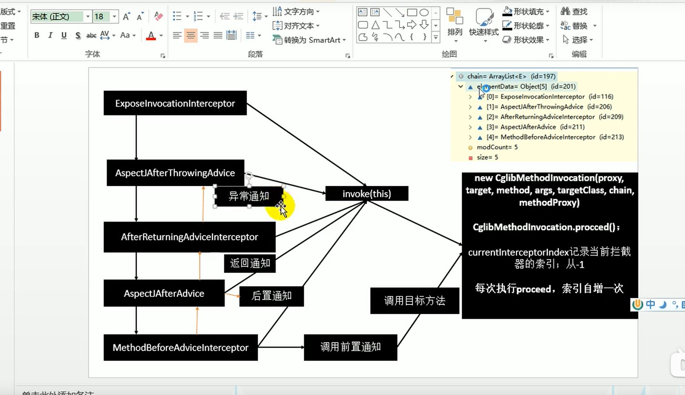

# AOP 原理
    1.@EnableAspectJAutoProxy是什么？
        1.  @Import(AspectJAutoProxyRegistrar.class)
            public @interface EnableAspectJAutoProxy {}
            给容器中导入AspectJAutoProxyRegistrar
            
        2.class AspectJAutoProxyRegistrar implements ImportBeanDefinitionRegistrar {}
            被导入的类是ImportBeanDefinitionRegistrar接口实现类，作用是调用registerBeanDefinitions()手动的将Bean注入进容器中
            
        3.registerBeanDefinitions()
            调用AopConfigUtils.registerAspectJAnnotationAutoProxyCreatorIfNecessary(registry);
            最后会创建一个 AnnotationAwareAspectJAutoProxyCreator 类型的叫做 internalAutoProxyCreator名称 的 BeanDefinition,并将它放入容器当中
            
    2.AnnotationAwareAspectJAutoProxyCreator 继承关系
            AnnotationAwareAspectJAutoProxyCreator
                -> AspectJAwareAdvisorAutoProxyCreator
                    -> AbstractAdvisorAutoProxyCreator
                        -> AbstractAutoProxyCreator
                            -> ProxyProcessorSupport
                               implements SmartInstantiationAwareBeanPostProcessor,BeanFactoryAware
        
            关注 SmartInstantiationAwareBeanPostProcessor 后置处理器, BeanFactoryAware 自动注入BeanFactory
        
        5. 继承后我们想要关注的后置处理器、BeanFactory注入的具体方法
            AbstractAutoProxyCreator.setBeanFactory()
            AbstractAutoProxyCreator,有后置处理器的逻辑
            AbstractAdvisorAutoProxyCreator.setBeanFactory()->initBeanFactory()
            AnnotationAwareAspectJAutoProxyCreator.initBeanFactory()
        
    3.注册 AnnotationAwareAspectJAutoProxyCreator 【SmartInstantiationAwareBeanPostProcessor】流程
        1.AnnotationConfigApplicationContext 传入配置类，创建IOC容器
        2.注册配置类，调用refresh()刷新容器
        3.在 refresh() 中调用 registerBeanPostProcessors(beanFactory); 注册后置处理器来方便拦截bean的创建
            1.先获取ioc中已经定义了（例如@EnableAspectJAutoProxy中会注入internalAutoProxyCreator进容器等）但是需要创建对象的所有BeanProcessor
            2.给容器中加其他的BeanPostProcessor
            3.优先注册实现了 PriorityOrdered 接口的BeanPostProcessor
            4.再给容器中注册实现了 Ordered 接口的BeanPostProcessor，而 AnnotationAwareAspectJAutoProxyCreator 则是实现了 Ordered 接口
            5.最后注册都没实现的接口的BeanPostProcessor
            6.注册 BeanPostProcessor，实际上就是创建 BeanPostProcessor 对象，保存在容器中
                创建 internalAutoProxyCreator 的 BeanPostProcessor 【AnnotationAwareAspectJAutoProxyCreator】
                1.创建Bean的实例
                    beanFactory.getBean()->doGetBean()->getSingleton->createBean()
                2.populateBean,给Bean的各种属性赋值
                3.initializeBean 初始化Bean
                    1.invokeAwareMethods 处理Aware接口的方法回调,在这里就会调用  AbstractAdvisorAutoProxyCreator   中的setBeanFactory
                    2.applyBeanPostProcessorsBeforeInstantiation() 应用后置处理器的 postProcessBeforeInstantiation
                    3.invokeInitMehods 执行自定义的初始化方法
                    4.applyBeanPostProcessorsAfterInstantiation（） 应用后置处理器的 postProcessAfterInstantiation
                4.BeanPostProcessor【AnnotationAwareAspectJAutoProxyCreator】 创建成功
            7.把 BeanPostProcessor 注册到 BeanFactory 中
    4.finishBeanFactoryInitialization(beanFactory)； 完成 BeanFactory 的初始化工作，创建剩下的单实例Bean
        1.遍历获取容器中所有的Bean，依次创建对象getBean(beanName)
            beanFactory.getBean()->doGetBean()->getSingleton()->createBean()
        2.创建bean
            1.先从缓存中获取，如果能获取到，说明bean是之前被创建过的，直接使用，否则再创建
            2.createBean()   创建bean，AnnotationAwareAspectJAutoProxyCreator【InstantiationAwareBeanPostProcessor】 会在任何bean创建之前尝试返回bean的实例
                【BeanPostProcessor 是在Bean对象创建完成初始化前后被调用的】
                【InstantiationAwareBeanPostProcessor 是在创建Bean实例之前先尝试用后置处理器返回对象的】
                1.resolveBeforeInstantiation(beanName,mbdToUse); 解析resolveBeforeInstantiation
                    希望后置处理器在此能返回一个代理对象，如果能返回代理对象，就用，如果不能就继续第二步
                    1.后置处理器尝试先返回对象(这里主要是为了判断bean是否需要跳过代理，如果这个bean是切面类的话，就不用代理直接第2步，如果如果没有 beanclass 所对应的 targetsource的话，也一样不会代理的）
                        bean = applyBeanPostProcessorsBeforeInstantiation(targetType, beanName);
                            拿到所有后置处理器，如果是 InstantiationAwareBeanPostProcessor;【新版本不判断直接执行】 就执行 Object result = bp.postProcessBeforeInstantiation(beanClass, beanName);
                        if (bean != null) {
                            bean = applyBeanPostProcessorsAfterInitialization(bean, beanName);      第6步
                        }
                        
                2.doCreateBean()
                    跟3.3.6一样，真正的去创建一个Bean
                    
    5.每一个bean创建之前，都会调用 postProcessorBeforeInstantiation();
        关心我们业务类MathCalcu和切面类LogAspect
        1.判断当前bean是否在 adviseedBeans中（保存了所有需要被增强的bean）
        2.判断当前bean是否是基础类型的 Advice、PointCut、Advisor 、AopInfrastructureBean 或者是否是切面 Aspect
        3.是否需要跳过
            1.获取候选的增强器（切面里的通知方法）【List<Advisor> candidateAdvisors = findCandidateAdvisors();】
    6.创建对象
        applyBeanPostProcessorsAfterInitialization -> postProcessAfterInitialization ->wrapIfNecessary 包装如果需要的情况下 ->getAdvicesAndAdvisorsForBean -> findEligibleAdvisors
            1.获取当前bean的所有增强器（通知方法） Object[] specificInterceptors = getAdvicesAndAdvisorsForBean(bean.getClass(), beanName, null);               
                1.找到当前bean的所有增强器（通知方法）
                2.获取到能在bean使用的增强器
                3.给增强器排序
            2.保存当前bean在 advisedBeans 中
            3.如果当前bean需要增强，创建当前bean的代理对象
                1.获取所有增强器（通知方法）
                2.保存到proxyFactory中
                3.创建代理对象,spring自动决定
                    JdkDynamicAopProxy(config);
                    ObjenesisCglibAopProxy(config);
            4.给容器中返回当前组件使用cglib增强了的代理对象
                以后容器中获取到的就是这个组件的代理对象，执行目标方法的时候，代理对象就会执行通知方法的流程
                
    7.目标方法执行
        容器中保存了组件的代理对象(cglib增强后的对象，这个对象保存了详细信息(比如增强器，目标对象，xxx）
            1.public Object intercept(Object proxy, Method method, Object[] args, MethodProxy methodProxy) 拦截目标方法的执行（注意，这里的步骤是对一个方法的循序渐进，不同于上面的不同方法按流程走）
            2.根据ProxyFactory获取拦截器链  List<Object> chain = this.advised.getInterceptorsAndDynamicInterceptionAdvice(method, targetClass);
                1.保存所有的拦截器 List<Object> interceptorList = new ArrayList<>(advisors.length);
                2.遍历所有的增强器，将其转为 Interceptor
                3.将增强器转为List<MehodInterceptor>
            3.如果没有拦截器链，直接执行目标方法。
                拦截器链：每一个通知方法会被包装成方法拦截器 MethodInterceptor ，之后调用的时候就会利用 MethodInterceptor 的特性
            4.如果有拦截器链，把需要执行的目标对象、目标方法、拦截器链等信息传入创建一个 CglibMethodInvocation 对象
                并调用 new CglibMethodInvocation(proxy, target, method, args, targetClass, chain, methodProxy).proceed();
            5.拦截器链的触发过程
                proceed()
                    if (this.currentInterceptorIndex == this.interceptorsAndDynamicMethodMatchers.size() - 1) {
                        return invokeJoinpoint();  
                    }
                    currentInterceptorIndex 记录当前拦截器的索引，每次执行proceed（） 索引都会自增一次，然后拿到下一个拦截器
                    
                
                1.如果索引初始值-1和拦截器链长度-1相等（没有拦截器），或者到了拦截器链的最后一个。就会调用这个方法通过反射执行目标方法
                2.链式获取每一个拦截器，拦截器执行invoke方法，每一个拦截器等待下一个拦截器执行完成返回后再来执行
                    拦截器链的机制，保证通知方法与目标方法的执行顺序   