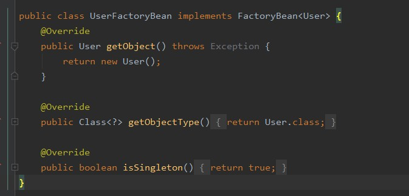
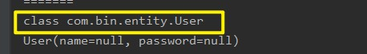
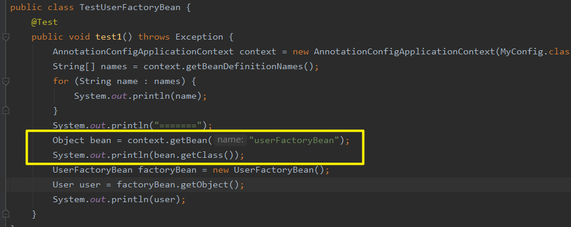
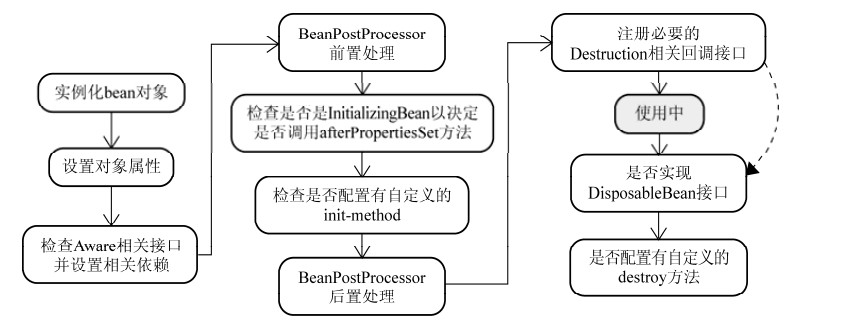
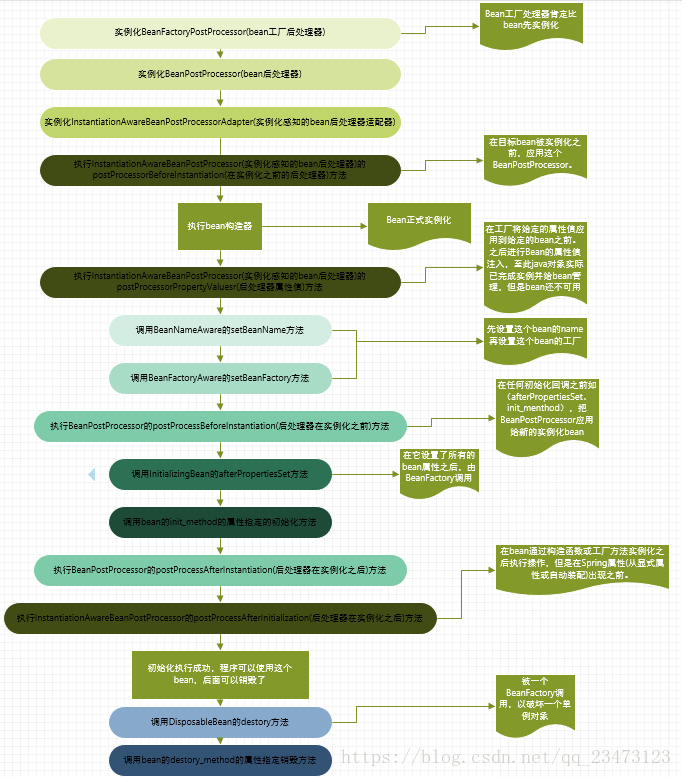

# 1.@lazy
懒加载，并非在容器创建的时候就创建这个Bean，而是在需要的用的时候再创建
# 2.@Scope
Bean的作用域
原型、单例
# 3.@Conditional

# 4.给容器中导入Bean的方法
## 1.包扫描+组件标注注解（需要在源码上标注）
## 2.@Bean+@Configuration（可以导入第三方的组件）
## 3.Import
    1. 根据.class数组导入全限定名Bean
    2. 实现ImportSelector接口，返回需要导入的Bean，然后将实现类.class放入注解value中
    3. 实现ImportBeanDefinitionRegistrar接口中的registerBeanDefinitions()，手动的将Bean注入进容器中
## 4.使用Spring提供的FactoryBean（工厂Bean）
    1.自定义工厂类实现 FactoryBean 接口,并将实现类注入到容器中，之后想要获得Bean时只需要调用getObject()
    2.虽然将实现类注入到容器中，但getClass()时可以看到其本身还是实现类,可见这样的方法得到的是工厂类的getObject()方法创建的对象




    3. 如果一定要获得工厂Bean，可以getBean("&userFactoryBean)
        这样的结果是:class com.bin.entity.UserFactoryBean
## 5.ImportResource
从XML中导入Bean

## 4.指定初始化和销毁方法

### 1.通过@Bean注解指定初始化和销毁方法
创建对象:
    单实例：在容器启动的时候创建对象
    多实例：在每次获取的时候创建对象
初始化：
    对象创建完成，并赋值好，调用初始化方法
销毁：
    单实例：容器关闭的时候
    多实例：容器不会管理这个Bean，不会调用销毁方法
    
```java
import com.bin.entity.User;import org.springframework.context.annotation.Configuration;
@Configuration
public class config{
    @Bean(initMethod="inti",destroyMethod="destroy")
    void User user(){
        return new User();
    }
}
```
其中inti()、destroy()定义在User实体类中即可

### 2.实现InitializingBean、DisposableBean两个接口分别指定初始化和销毁方法
    afterPropertiesSet 也是初始化方法，是在Bena被实例化后，所有属性被设置好之后调用被注解的方法
```java
public class Cat implements InitializingBean, DisposableBean {

    public Cat() {
        System.out.println("miao");
    }

    @Override
    public void afterPropertiesSet() throws Exception {
        System.out.println("afterPropertiesSet");
    }

    @Override
    public void destroy() throws Exception {
        System.out.println("destroy");
    }
}
```
其中 InitializingBean 中存在afterPropertiesSet 方法，DisposableBean 中存在 destroy 方法

### 3.使用JSR250 定义的两个注解
    这两个注解是在实体类中，指定初始化方法和销毁方法，功能类似@Bean
    @PostConstruct  在对象创建完成，并赋值之后调用
    @PreDestroy   在容器移除对象之前调用
```java
public class Dog{
    public Dog(){
    
    }

    @PostConstruct
    public void init(){
    System.out.println("初始化");
    }   

    @PreDestroy
    public void destroy(){
        System.out.println("销毁");
    }
}
```

### 4.BeanPostProcessor【interface】:bean的后置处理器
    postProcessBeforeInitialization : 在构造方法之后工作  会先于所有的初始化方法执行,例如afterPropertiesSet、@PostConstruct
    postProcessAfterInitialization : 在构造方法之后工作并且在其他初始化方法之后执行
    

```java
@Component
public class MyBeanPostProcessor implements BeanPostProcessor {
    @Override
    public Object postProcessBeforeInitialization(Object bean, String beanName) throws BeansException {
        System.out.println("postProcessBeforeInitialization"+"->"+beanName);
        return bean;
    }

    @Override
    public Object postProcessAfterInitialization(Object bean, String beanName) throws BeansException {
        System.out.println("postProcessAfterInitialization"+"->"+beanName);
        return bean;
    }
}
```    

#### 4.1 BeanPostProcessor 原理

    遍历得到容器中所有的BeanPostProcessor，挨个执行beforeInitialization
    一旦返回null，跳出for循环，就不会执行后序的BeanPostProcessor
    
    执行流程:
    populateBean()              给Bean进行属性赋值
    ->applyBeanPostProcessorBeforeInitializatin()       在初始化方法执行之前处理
    ->invokeInitMethods     执行初始化方法
    ->applyBeanPostProcessorAfterInitializtion()        在初始化方法执行之后处理
    
#### 4.2 BeanPostProcessor 在Spring中的使用
    1. 实现 ApplicationContextAware 接口可以给Bean中注入Spring上下文，之后在类中就可以使用上下文
  
```java
public class Dog implements ApplicationContextAware {
    private ApplicationContext applicationContext;
    
    @Override
    public void setApplicationContext(ApplicationContext applicationContext) throws BeansException {
        this.applicationContext = applicationContext;
    }
}
``` 

    而实现这一切的原理就是调用 BeanPostProcessor ，在初始化之前判断方法是否实现自 ApplicationContextAware 接口，如果确实是那么就会调用方法
    向其中set进Spring上下文
    
    2. @Validate 对Bean 的属性进行校验 其中就用到了 BeanPostProcessor 
    3. @PostConstruct
    4. @Autowired
    
# 5.整个Spring的生命周期


    1.实例化 BeanFactoryPostProcessor 实现类
    2.执行 BeanFactoryPostProcessor 的 postProcessorBeanFactory 方法
    3.实例化 BeanPostProcessor 实现类
    4.实例化 InstantiationAwareBeanPostProcessorAdapter 实现类
    4.执行 InstantiationAwareBeanPostProcessorAdapter 的 postProcessorBeforeInstallation 方法
        InstantiationAwareBeanPostProcessor 会拦截所有bean的创建，如果有通知方法，就会创建一个增强代理对象代替原始对象放入容器中。
        如果这里有自定义 TargetSource 就会在这里创建代理对象，否则会在第13步创建代理对象 
    5.创建bean对象放入容器
    6.执行 InstantiationAwareBeanPostProcessor 的 postProcessPropertyValues 方法（新版本用 postProcessPropertyValues 将其代替）
        这个方法可以在给定Bean的属性之前，对Bean的属性进行检验（比如是否required = true）或者替换要应用的属性定义值（比如@Value或者XML中写死的）
    7.为Bean应用定义时的属性（不会替换上一步的结果，如果执行了上一步就维持，不然就应用定义的属性了）
    8.如果bean实现了 xxxAware 接口，则调用 setXXX() 给bean中注入Spring组件(BeanNameAware、BeanFactoryAware）
    9.执行 BeanPostProcessor 的 postProcessBeforeInitialization 方法
    10.如果bean实现了 InitializingBean 接口，则会调用 afterPropertiesSet 方法
    11.如果bean有 初始化 方法（@PostConstruct、@Bean指定init方法），那么会调用这些初始化方法
    12.执行 BeanPostProcessor 的 postProcessAfterInitialization 方法
    13.执行 InstantiationAwareBeanPostProcessor 的 postProcessAfterInitialization 方法
        在这里会创建第4步的代理对象
    14.bean注入容器成功，正常使用后，容器开始销毁
    15.如果bean实现了 DisposableBean 接口，就会调用 destroy 方法
    16.调用自定义的销毁方法(@PreDestroy、@Bean指定destory方法)