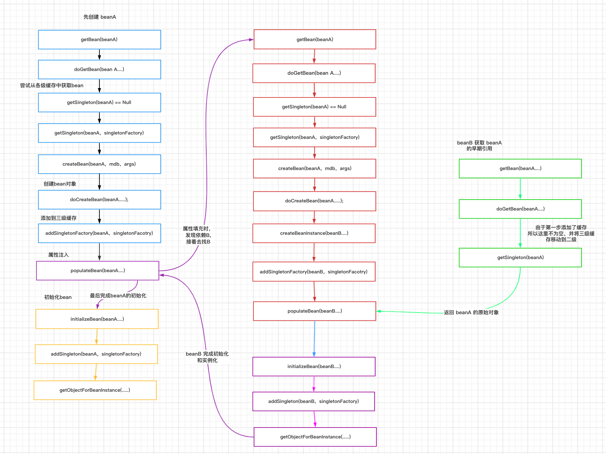
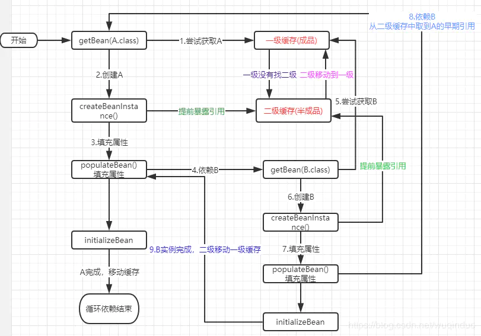

# setter 循环依赖

beanA、beanB循环依赖，流程: 
    1、当我们在调用getBean()获取bean时，实际调用的是doGetBean() 方法。doGetBean() 想要获取 beanA ，于是调用 getSingleton() 方法从缓存中查找 beanA
    2、在 getSingleton() 方法中，从「一级缓存」中查找，没有并且并不在 正在创建集合中，返回 null
```shell script
    	@Nullable
    	protected Object getSingleton(String beanName, boolean allowEarlyReference) {
    		// Quick check for existing instance without full singleton lock
    		Object singletonObject = this.singletonObjects.get(beanName);   // 先从一级缓存中取
    
    // 这里的isSingletonCurrentlyInCreation,判断是否当前Bean正在创建中,靠的是其中的singletonsCurrentlyInCreation(HashMap)来记录,会在getSingleton()中将beanName放入其中
    		if (singletonObject == null && isSingletonCurrentlyInCreation(beanName)) {    
    
    			singletonObject = this.earlySingletonObjects.get(beanName);     // 然后再去二级缓存中取
    
    			if (singletonObject == null && allowEarlyReference) {     // allowEarlyReference 默认为true
    				synchronized (this.singletonObjects) {
    					// Consistent creation of early reference within full singleton lock
    					singletonObject = this.singletonObjects.get(beanName);    // 双重校验
    					if (singletonObject == null) {
    						singletonObject = this.earlySingletonObjects.get(beanName);
    						if (singletonObject == null) {
    						  
    							ObjectFactory<?> singletonFactory = this.singletonFactories.get(beanName);    // 从三级缓存中得到对应Bean的ObjectFactory,这个工厂可以获得Bean的早期对象引用
    							if (singletonFactory != null) {
    								singletonObject = singletonFactory.getObject();     // 获得早期对象引用
    								this.earlySingletonObjects.put(beanName, singletonObject);    // 将此Bean的信息从第三缓存移除,放入第二缓存
    								this.singletonFactories.remove(beanName);
    							}
    						}
    					}
    				}
    			}
    		}
    		return singletonObject;
    	}
 ```

    3、doGetBean() 方法中获取到 beanA 为 null ，于是走对应的处理逻辑，调用 getSingleton() 的重载方法(参数为 ObjectFactory 的)
```shell script
                // Create bean instance.
                if (mbd.isSingleton()) {
                    sharedInstance = getSingleton(beanName, () -> {
                        try {
                            return createBean(beanName, mbd, args);   // 这里的先后顺序是:先调用getSingleton,然后再其中会调用ObjectFactory的getObject(),这个方法会调用匿名函数中的createBean(),创建Bean
                        }
                        catch (BeansException ex) {
                            // Explicitly remove instance from singleton cache: It might have been put there
                            // eagerly by the creation process, to allow for circular reference resolution.
                            // Also remove any beans that received a temporary reference to the bean.
                            destroySingleton(beanName);
                            throw ex;
                        }
                    });
                    beanInstance = getObjectForBeanInstance(sharedInstance, name, beanName, mbd);
                }
```
    
    4、在 getSingleton()方法中，先调用 beforeSingletonCreation() 将 beanA_name 添加到一个集合中，用于标记该 bean 正在创建中，然后回调匿名内部类的 createBean 方法
```shell script
	public Object getSingleton(String beanName, ObjectFactory<?> singletonFactory) {
		Assert.notNull(beanName, "Bean name must not be null");
		synchronized (this.singletonObjects) {
			Object singletonObject = this.singletonObjects.get(beanName);
			if (singletonObject == null) {
				if (this.singletonsCurrentlyInDestruction) {
					throw new BeanCreationNotAllowedException(beanName,
							"Singleton bean creation not allowed while singletons of this factory are in destruction " +
							"(Do not request a bean from a BeanFactory in a destroy method implementation!)");
				}
				if (logger.isDebugEnabled()) {
					logger.debug("Creating shared instance of singleton bean '" + beanName + "'");
				}

				beforeSingletonCreation(beanName);      // 在这个方法中,会将beanName放入singletonsCurrentlyInCreation中,一遍后面判断这个bean是否正在创建

				boolean newSingleton = false;
				boolean recordSuppressedExceptions = (this.suppressedExceptions == null);
				if (recordSuppressedExceptions) {
					this.suppressedExceptions = new LinkedHashSet<>();
				}
				try {
					singletonObject = singletonFactory.getObject();    // 回调匿名内部类的 createBean() 创建beanA
					newSingleton = true;
				}
				catch (IllegalStateException ex) {
					// Has the singleton object implicitly appeared in the meantime ->
					// if yes, proceed with it since the exception indicates that state.
					singletonObject = this.singletonObjects.get(beanName);
					if (singletonObject == null) {
						throw ex;
					}
				}
				catch (BeanCreationException ex) {
					if (recordSuppressedExceptions) {
						for (Exception suppressedException : this.suppressedExceptions) {
							ex.addRelatedCause(suppressedException);
						}
					}
					throw ex;
				}
				finally {
					if (recordSuppressedExceptions) {
						this.suppressedExceptions = null;
					}
					afterSingletonCreation(beanName);         // 这个方法中会移除 singletonsCurrentlyInCreation 中此beanName的信息
				}
				if (newSingleton) {
					addSingleton(beanName, singletonObject);    // 在这个方法中,会将beanName放入一级缓存中,同时将其从二、三级缓存中移除
				}
			}
			return singletonObject;
		}
	}
``` 
  
    5、先执行匿名内部类的 createBean 方法，然后进入 AbstractAutowireCapableBeanFactory#doCreateBean，先反射调用构造器创建出 beanA 的实例，然后判断，是否为单例，是否允许提前暴露引用（对于单例一般为true）、是否正在创建中（即是否是在第四步的集合中）判断为 true 则将 beanA 添加到「三级缓存」中
    6、对 beanA 进行属性填充，此时检测到 beanA 依赖于 beanB ，于是查找 beanB
```shell script
	protected Object doCreateBean(String beanName, RootBeanDefinition mbd, @Nullable Object[] args)
			throws BeanCreationException {

		// Instantiate the bean.
		BeanWrapper instanceWrapper = null;
		if (mbd.isSingleton()) {
			instanceWrapper = this.factoryBeanInstanceCache.remove(beanName);
		}
		if (instanceWrapper == null) {
			instanceWrapper = createBeanInstance(beanName, mbd, args);
		}
		Object bean = instanceWrapper.getWrappedInstance();
		Class<?> beanType = instanceWrapper.getWrappedClass();
		if (beanType != NullBean.class) {
			mbd.resolvedTargetType = beanType;
		}

		// Allow post-processors to modify the merged bean definition.
		synchronized (mbd.postProcessingLock) {
			if (!mbd.postProcessed) {
				try {
					applyMergedBeanDefinitionPostProcessors(mbd, beanType, beanName);
				}
				catch (Throwable ex) {
					throw new BeanCreationException(mbd.getResourceDescription(), beanName,
							"Post-processing of merged bean definition failed", ex);
				}
				mbd.postProcessed = true;
			}
		}

		// Eagerly cache singletons to be able to resolve circular references
		// even when triggered by lifecycle interfaces like BeanFactoryAware.

//判断,是否为单例,是否允许提前暴露引用(对于单例一般为true)、是否正在创建中(即是否是在第四步的集合中)判断为 true 则将 beanA 添加到「三级缓存」中
		boolean earlySingletonExposure = (mbd.isSingleton() && this.allowCircularReferences &&
				isSingletonCurrentlyInCreation(beanName));
		if (earlySingletonExposure) {
			if (logger.isTraceEnabled()) {
				logger.trace("Eagerly caching bean '" + beanName +
						"' to allow for resolving potential circular references");
			}
			addSingletonFactory(beanName, () -> getEarlyBeanReference(beanName, mbd, bean));      // 添加到三级缓存中
		}

		// Initialize the bean instance.
		Object exposedObject = bean;
		try {
			populateBean(beanName, mbd, instanceWrapper);     // 先填充BeanA的属性,发现依赖beanB,于是要去getBean(B)
			exposedObject = initializeBean(beanName, exposedObject, mbd);   // 然后初始化Bean
		}
		catch (Throwable ex) {
			if (ex instanceof BeanCreationException && beanName.equals(((BeanCreationException) ex).getBeanName())) {
				throw (BeanCreationException) ex;
			}
			else {
				throw new BeanCreationException(
						mbd.getResourceDescription(), beanName, "Initialization of bean failed", ex);
			}
		}

		if (earlySingletonExposure) {
			Object earlySingletonReference = getSingleton(beanName, false);
			if (earlySingletonReference != null) {
				if (exposedObject == bean) {
					exposedObject = earlySingletonReference;
				}
				else if (!this.allowRawInjectionDespiteWrapping && hasDependentBean(beanName)) {
					String[] dependentBeans = getDependentBeans(beanName);
					Set<String> actualDependentBeans = new LinkedHashSet<>(dependentBeans.length);
					for (String dependentBean : dependentBeans) {
						if (!removeSingletonIfCreatedForTypeCheckOnly(dependentBean)) {
							actualDependentBeans.add(dependentBean);
						}
					}
					if (!actualDependentBeans.isEmpty()) {
						throw new BeanCurrentlyInCreationException(beanName,
								"Bean with name '" + beanName + "' has been injected into other beans [" +
								StringUtils.collectionToCommaDelimitedString(actualDependentBeans) +
								"] in its raw version as part of a circular reference, but has eventually been " +
								"wrapped. This means that said other beans do not use the final version of the " +
								"bean. This is often the result of over-eager type matching - consider using " +
								"'getBeanNamesForType' with the 'allowEagerInit' flag turned off, for example.");
					}
				}
			}
		}

		// Register bean as disposable.
		try {
			registerDisposableBeanIfNecessary(beanName, bean, mbd);
		}
		catch (BeanDefinitionValidationException ex) {
			throw new BeanCreationException(
					mbd.getResourceDescription(), beanName, "Invalid destruction signature", ex);
		}

		return exposedObject;
	}

```
    7、调用 doGetBean() 方法，和上面 beanA 的过程一样，到缓存中查询 beanB ，没有则创建，然后给 beanB 填充属性
    
    8、此时 beanB 依赖于 beanA ，调用 getSingleton() 获取 beanA ,依次从一级、二级、三级缓存中找、此时从「三级缓存」中获取到 beanA 的创建工厂，通过创建工厂获取到 singletonObject ，此时这个 singletonObject 指向的就是上面在 doCreateBean() 方法中实例化的 beanA
```shell script
	protected Object getSingleton(String beanName, boolean allowEarlyReference) {
		// Quick check for existing instance without full singleton lock
		Object singletonObject = this.singletonObjects.get(beanName);
		if (singletonObject == null && isSingletonCurrentlyInCreation(beanName)) {
			singletonObject = this.earlySingletonObjects.get(beanName);
			if (singletonObject == null && allowEarlyReference) {
				synchronized (this.singletonObjects) {
					// Consistent creation of early reference within full singleton lock
					singletonObject = this.singletonObjects.get(beanName);
					if (singletonObject == null) {
						singletonObject = this.earlySingletonObjects.get(beanName);
						if (singletonObject == null) {
							ObjectFactory<?> singletonFactory = this.singletonFactories.get(beanName);
							if (singletonFactory != null) {
								singletonObject = singletonFactory.getObject();     // 如果从三级缓存中得到了beanA,则将beanA放入二级缓存,并从三级缓存中移除
								this.earlySingletonObjects.put(beanName, singletonObject);
								this.singletonFactories.remove(beanName);
							}
						}
					}
				}
			}
		}
		return singletonObject;
	}
```
    9、这样 beanB 就获取到了 beanA 的依赖，于是 beanB 顺利完成初始化，并将 beanA 从「三级缓存」移动到「二级缓存」中
    
    10、随后 beanA 继续他的属性填充工作，此时也获取到了 beanB ，beanA 也随之完成了创建，回到 getSingleton() 方法中继续向下执行，将 beanA 从「二级缓存」移动到「一级缓存」中
```shell script
	public Object getSingleton(String beanName, ObjectFactory<?> singletonFactory) {
		Assert.notNull(beanName, "Bean name must not be null");
		synchronized (this.singletonObjects) {
			Object singletonObject = this.singletonObjects.get(beanName);
			if (singletonObject == null) {
				if (this.singletonsCurrentlyInDestruction) {
					throw new BeanCreationNotAllowedException(beanName,
							"Singleton bean creation not allowed while singletons of this factory are in destruction " +
							"(Do not request a bean from a BeanFactory in a destroy method implementation!)");
				}
				if (logger.isDebugEnabled()) {
					logger.debug("Creating shared instance of singleton bean '" + beanName + "'");
				}

				beforeSingletonCreation(beanName);      // 在这个方法中,会将beanName放入singletonsCurrentlyInCreation中,一遍后面判断这个bean是否正在创建

				boolean newSingleton = false;
				boolean recordSuppressedExceptions = (this.suppressedExceptions == null);
				if (recordSuppressedExceptions) {
					this.suppressedExceptions = new LinkedHashSet<>();
				}
				try {
					singletonObject = singletonFactory.getObject();    // 回调匿名内部类的 createBean() 创建beanA
					newSingleton = true;
				}
				catch (IllegalStateException ex) {
					// Has the singleton object implicitly appeared in the meantime ->
					// if yes, proceed with it since the exception indicates that state.
					singletonObject = this.singletonObjects.get(beanName);
					if (singletonObject == null) {
						throw ex;
					}
				}
				catch (BeanCreationException ex) {
					if (recordSuppressedExceptions) {
						for (Exception suppressedException : this.suppressedExceptions) {
							ex.addRelatedCause(suppressedException);
						}
					}
					throw ex;
				}
				finally {
					if (recordSuppressedExceptions) {
						this.suppressedExceptions = null;
					}
					afterSingletonCreation(beanName);         // 这个方法中会移除 singletonsCurrentlyInCreation 中此beanName的信息
				}
				if (newSingleton) {
					addSingleton(beanName, singletonObject);    // 在这个方法中,会将beanName放入一级缓存中,同时将其从二、三级缓存中移除
				}
			}
			return singletonObject;
		}
	}
```

## 为什么需要三层依赖，而不是两层
两层的情况
    不等创建完成，有了引用后，提前放入半成品缓存
  

    A引用创建后，提前暴露到半成品缓存中
    依赖B，创建B ，B填充属性时发现依赖A， 先从成品缓存查找，没有,再从半成品缓存查找 取到A的早期引用。
    B顺利走完创建过程, 将B的早期引用从半成品缓存移动到成品缓存
    B创建完成，A获取到B的引用，继续创建。
    A创建完成，将A的早期引用从半成品缓存移动到成品缓存
    完美解决循环依赖

两层可以解决部分循环依赖问题，但不是全部:
    Bean在创建的最后阶段，会检查是否需要创建代理，如果创建了代理，那么最终返回的就是代理实例的引用。我们通过beanName获取到最终是代理实例的引用。
    也就是说：上文中，假设A最终会创建代理，提前暴露A的引用， B填充属性时填充的是A的原始对象引用。A最终放入成品库里是代理的引用。那么B中依然是A的早期引用。这种结果最终会与我们的期望的大相径庭了。

所以关键在于第三缓存，工厂缓存解决了代理对象的引用问题:
    在doCreateBean()中会调用 addSingletonFactory(beanName, () -> getEarlyBeanReference(beanName, mbd, bean));  向三级缓存中添加当前bean的工厂类
```shell script
早期的扩展处理
protected Object getEarlyBeanReference(String beanName, RootBeanDefinition mbd, Object bean) {
        Object exposedObject = bean;
        if (bean != null && !mbd.isSynthetic() && hasInstantiationAwareBeanPostProcessors()) {
            for (BeanPostProcessor bp : getBeanPostProcessors()) {
                if (bp instanceof SmartInstantiationAwareBeanPostProcessor) {
                    SmartInstantiationAwareBeanPostProcessor ibp = (SmartInstantiationAwareBeanPostProcessor) bp;
                    exposedObject = ibp.getEarlyBeanReference(exposedObject, beanName);
                    if (exposedObject == null) {
                        return null;
                    }
                }
            }
        }
        return exposedObject;
    }
```
通过第三级缓存，可以将 需要提前代理的bean 进行代理，这样可以保证依赖它的bean得到正确的依赖，而不至于把所有的bean都先代理。

    如果当前存在AOP的后置处理器，那么调用 getObject() 就会调用下面这个方法
```shell script
public Object getEarlyBeanReference(Object bean, String beanName) throws BeansException {
        Object cacheKey = getCacheKey(bean.getClass(), beanName);
        this.earlyProxyReferences.put(cacheKey, bean);
        return wrapIfNecessary(bean, beanName, cacheKey);   // 这里就会尝试创建代理类
}
```

# 构造器循环依赖
如果您主要使用构造器注入，循环依赖场景是无法解决的。建议你用 setter 注入方式代替构造器注入

其实也不是说只要是构造器注入就会有循环依赖问题，Spring 在创建 Bean 的时候默认是按照自然排序来进行创建的，我们暂且把先创建的 bean 叫主 bean，上文的 A 即主 bean，只要主 bean 注入依赖 bean 的方式是 setter  方式，依赖 bean 的注入方式无所谓，都可以解决，反之亦然

所以上文我们 AB 循环依赖问题，只要 A 的注入方式是 setter ，就不会有循环依赖问题。

面试官问：为什么呢？

Spring 解决循环依赖依靠的是 Bean 的“中间态”这个概念，而这个中间态指的是已经实例化，但还没初始化的状态。实例化的过程又是通过构造器创建的，如果 A 还没创建好出来，怎么可能提前曝光，所以构造器的循环依赖无法解决，我一直认为应该先有鸡才能有蛋。
