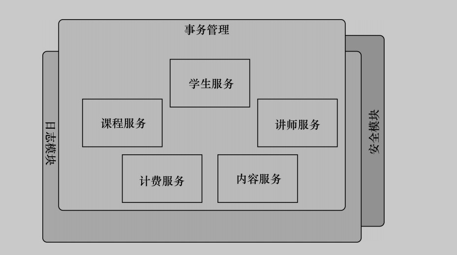

AOP实现原理

1、Spring提供了两种方式来生成代理对象: JDKProxy和Cglib，具体使用哪种方式生成由AopProxyFactory根据AdvisedSupport对象的配置来决定。默认的策略是如果目标类是接口，则使用JDK动态代理技术，否则使用Cglib来生成代理。可以通过@EnableAspectJAutoProxy 注解的proxyTargetClass属性来设置。

2、JDK的动态代理是基于反射（动态代理）实现。JDK通过反射，生成一个代理类，这个代理类实现了原来那个类的全部接口，并对接口中定义的所有方法进行了代理。当我们通过代理对象执行原来那个类的方法时，代理类底层会通过反射机制，回调我们实现的InvocationHandler接口的invoke方法。并且这个代理类是Proxy类的子类。
优点：
    JDK动态代理是JDK原生的，不需要任何依赖即可使用；
   通过反射机制生成代理类的速度要比CGLib操作字节码生成代理类的速度更快；
缺点：
    如果要使用JDK动态代理，被代理的类必须实现了接口，否则无法代理；
    JDK动态代理无法为没有在接口中定义的方法实现代理，假设我们有一个实现了接口的类，我们为它的一个不属于接口中的方法配置了切面，Spring仍然会使用JDK的动态代理，但是由于配置了切面的方法不属于接口，为这个方法配置的切面将不会被织入。
    JDK动态代理执行代理方法时，需要通过反射机制进行回调，此时方法执行的效率比较低；

3、CGLib实现动态代理的原理是，底层采用了ASM字节码生成框架，直接对需要代理的类的字节码进行操作，生成这个类的一个子类，并重写了类的所有可以重写的方法，在重写的过程中，将我们定义的额外的逻辑（简单理解为Spring中的切面）织入到方法中，对方法进行了增强。而通过字节码操作生成的代理类，和我们自己编写并编译后的类没有太大区别。
优点：
    使用CGLib代理的类，不需要实现接口，因为CGLib生成的代理类是直接继承自需要被代理的类；
    CGLib生成的代理类是原来那个类的子类，这就意味着这个代理类可以为原来那个类中，所有能够被子类重写的方法进行代理；
    CGLib生成的代理类，和我们自己编写并编译的类没有太大区别，对方法的调用和直接调用普通类的方式一致，所以CGLib执行代理方法的效率要高于JDK的动态代理；
缺点：
    由于CGLib的代理类使用的是继承，这也就意味着如果需要被代理的类是一个final类，则无法使用CGLib代理；
    由于CGLib实现代理方法的方式是重写父类的方法，所以无法对final方法，或者private方法进行代理，因为子类无法重写这些方法；
    CGLib生成代理类的方式是通过操作字节码，这种方式生成代理类的速度要比JDK通过反射生成代理类的速度更慢；
    
    
动态代理原理：
    1.获取被代理对象的引用，并且获取它的所有接口，反射获取
    2.JDK动态代理重新生成一个新的类，同时新的类要实现被代理类实现的所有接口
    3.动态生成Java代码，新加的业务逻辑方法会加入生成代码中
    4.编译新生成的Java代码.class文件
    5.重新加载到JVM
    
代理模式和装饰器模式区别:(装饰器使用了向上转型，在子类中重写了接口的方法，增强了原有的方法，但向上转型之后还是原来的类型。)
    相同点：
        1、都是对现有类的加强
        2、代理模式需要被代理者和代理方实现同一个interface，而装饰器模式也需要装饰的类和被装饰类实现同一个接口
    不同点：
        1、装饰器模式是使用的调用者从外部传入的被装饰对象，调用者只想要你把他给你的对象装饰（加强）一下。而代理模式使用的是代理对象在自己的构造方法里面new的一个被代理的对象，不是调用者传入的。调用者不知道你找了其他人，他也不关心这些事，只要你把事情做对了即可。装饰模式主要是强调对类中代码的拓展，而代理模式则偏向于委托类的访问限制。
        2、装饰器模式是因为没法在编译器就确定一个对象的功能，需要运行时动态的给对象添加职责，所以只能把对象的功能拆成一一个个的小部分，动态组装。但是代理模式在编译器其实就已经确定了和代理对象的关系。
        3、代理模式如果要使用增强的功能，就需要new一个代理对象才能使用。而装饰器模式可以对原来的对象进行增强，而不会变成新的对象。
        4、装饰模式主要是强调对类中代码的拓展，而代理模式则偏向于委托类的访问限制。
        
        
        
>https://www.cnblogs.com/liuyk-code/p/9886033.html
>https://www.zhihu.com/question/23641679
>https://blog.csdn.net/moreevan/article/details/11977115/
>https://blog.csdn.net/mhmyqn/article/details/48474815
>https://blog.csdn.net/lusa1314/article/details/83347945
>https://www.cnblogs.com/gonjan-blog/p/6685611.html 
