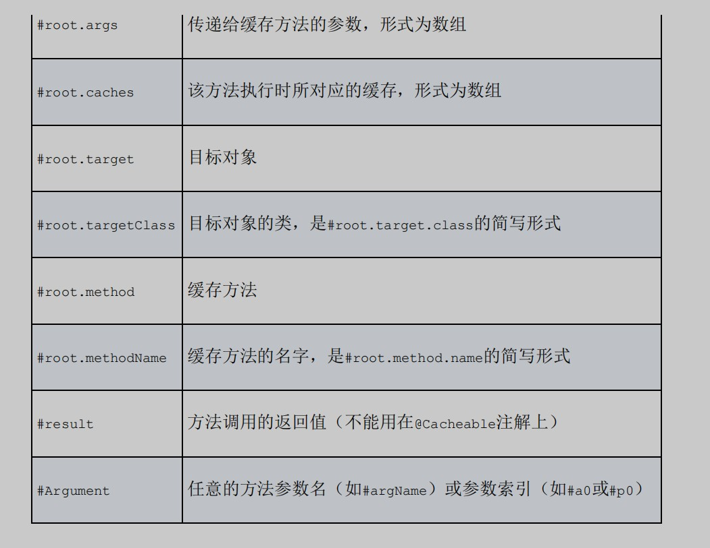
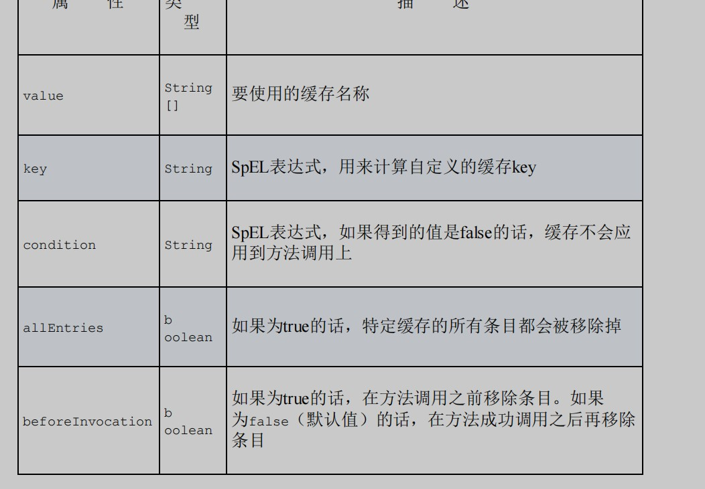

在为缓存编写SpEL表达式的时候，Spring暴露了一些很有用的元数据。下图列出了SpEL中可用的缓存元数据

@CacheEvict的一些属性与@Cacheable和@CachePut 是相同的，另外还有几个新的属性。与@Cacheable和@CachePut 不同，@CacheEvict并没有提供unless属性。

需要注意的是，这里讲的都是老版本的Spring4，而现在的Spring5中，又新增了许多属性
