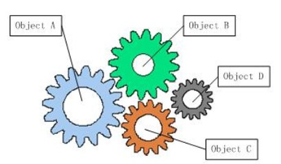

#什么是IOC

在没有IOC之前，一个任务由多个对象合力像齿轮一样，协同工作，共同完成任务。对象间的耦合时无法避免的，一个对象为了使用另一个对象的功能，必须自己创建一个那个对象。

而IOC就是为了解耦的。在使用了IOC后，完成一个任务并不像之前那样紧密连接在一起的齿轮状，而是由一个容器来粘合所有的对象。对象要使用其他对象功能时，并不需要自己实现，而是由容器生产一个对象再赋给它。

软件系统在没有引入IOC容器之前，对象A依赖于对象B，那么对象A在初始化或者运行到某一点的时候，自己必须主动去创建对象B或者使用已经创建的对象B。无论是创建还是使用对象B，控制权都在自己手上。

软件系统在引入IOC容器之后，这种情形就完全改变了，由于IOC容器的加入，对象A与对象B之间失去了直接联系，所以，当对象A运行到需要对象B的时候，IOC容器会主动创建一个对象B注入到对象A需要的地方。

通过前后的对比，我们不难看出来：对象A获得依赖对象B的过程,由主动行为变为了被动行为，控制权颠倒过来了，这就是“控制反转”这个名称的由来。

# DI
IOC是一种设计思想，一个重要的面向对象编程的法则，它能指导我们如何设计出松耦合、更优良的程序。
而DI（依赖注入）则是一种方法，是IOC的实现。

